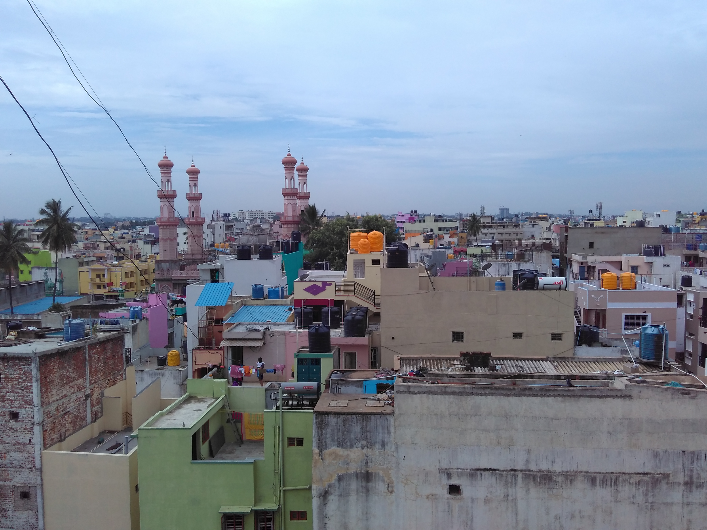
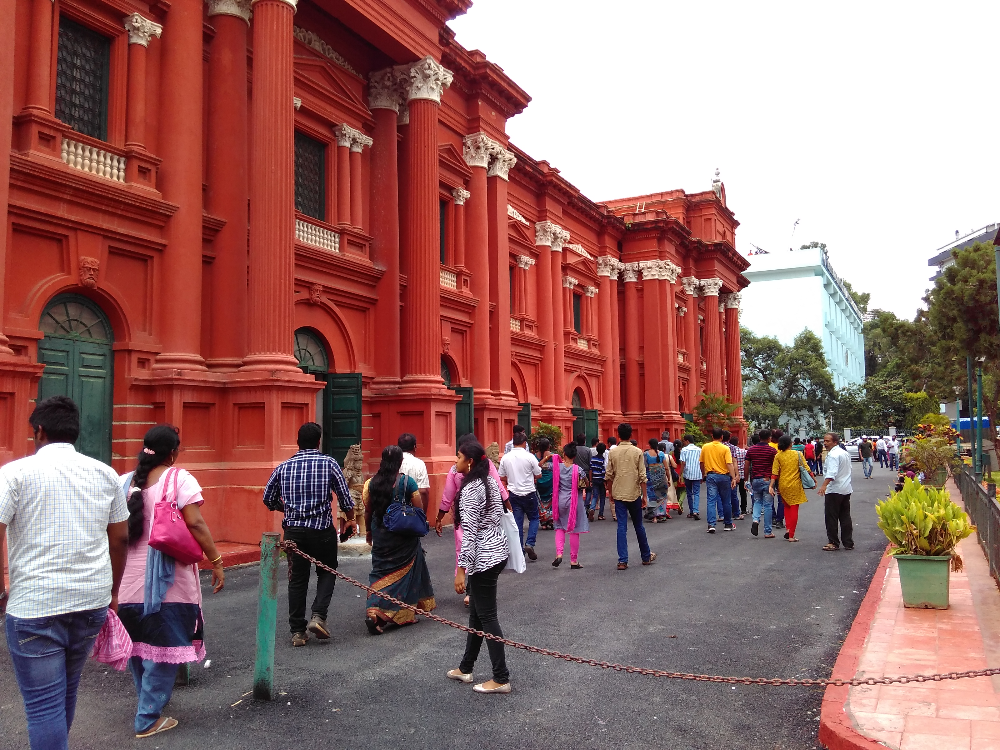
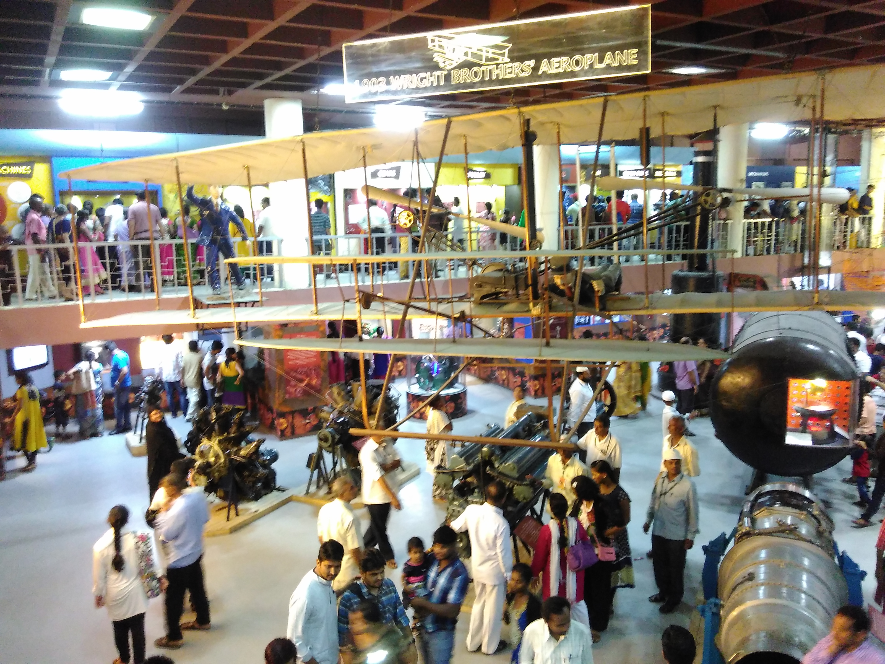
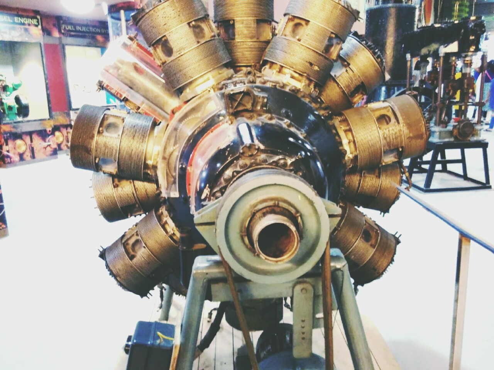
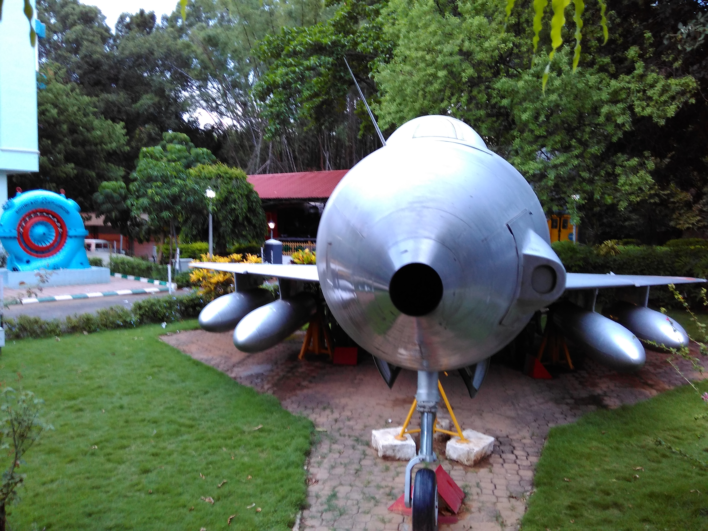
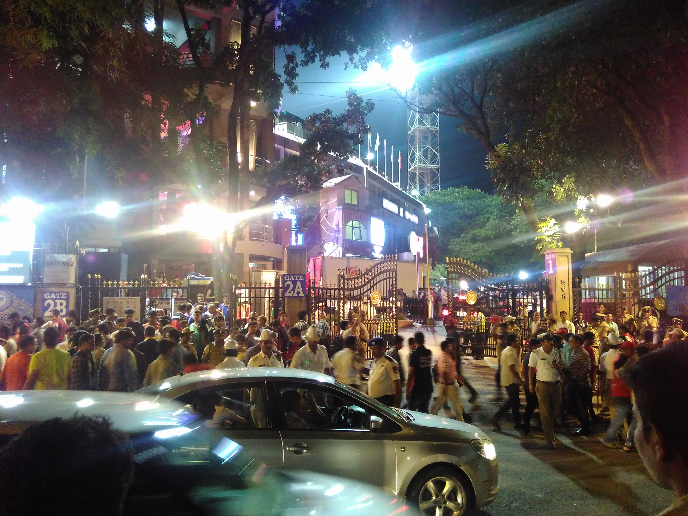
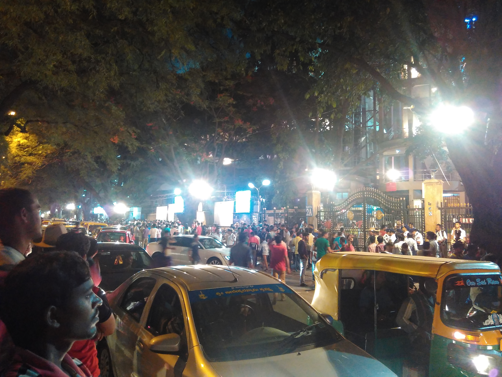
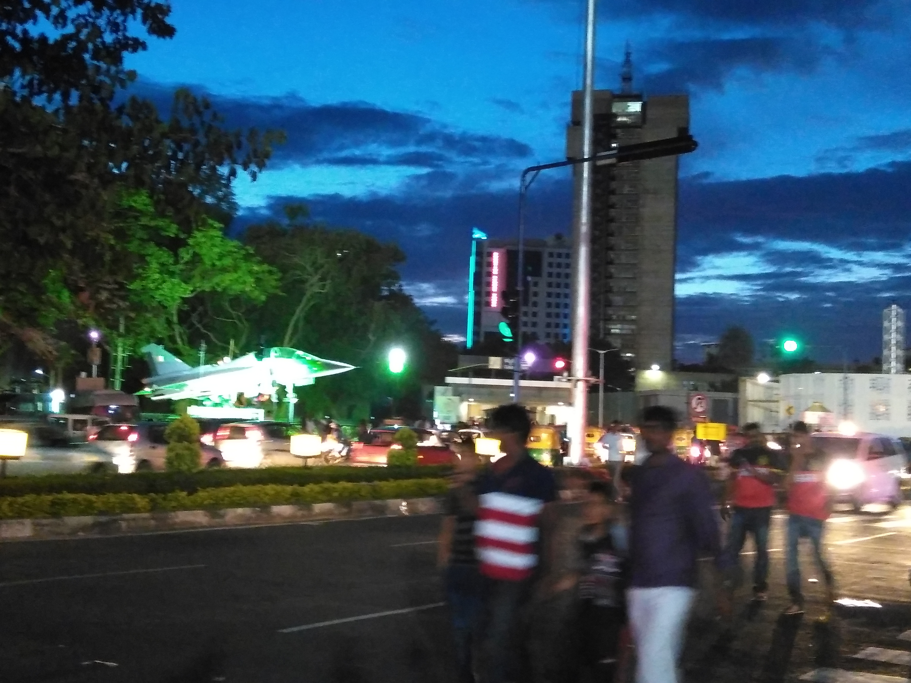

Title: Internship Diary 2016 | Bangalore | Day 0 
Date: 2016-05-31 10:00 PM
Category: Internship
Tags: Bangalore, internship, city, exploration, fun
Summary: Exploring Bangalore on Day 0 

##What a fantastic first day!

There are two prominent things which sets this day apart but first let me tell you something about the starting journey.

So we reached Bangalore at 8:00 AM, got down at what seemed to be the middle of the road, searched on Google maps for the actual location of our destination hotel and finally called Uber to reach there. Hotel room is okayish. It's at the 5th floor and the lift is quite narrow. Once I reached the room, I freshened myself and got ready to have brunch. 

	 
	
*View from our hotel room*

We hunted down the nearest nice place to eat and found a mall nearby at around 2.5km. We walked till there, which was a nice workout in relatively stinky areas of Bangalore. It was a medium sized mall. We directly started our hunt on the food court after reaching there. Lot of rounds around, we finally decided to go our own way and eat whatever we want, later to meet at the specified place. 

I went to Mcdonals with my friend and as usual had a nice burger there. The other two joined us there itself. After the so-called "meal", we thought of taking a metro back to our hotel. It had a metro station nearby. But we came to know the this line has no connection with the line we wanted to take the metro for. Anyway when we came out of the station, we immediately got a bus and came back to the hotel. 

And it was just a start. I wanted to roam around this wonderful city and so I searched about **the places to visit in Bangalore**. The nearest one and certainly worthy was **Visvesvaraya Industrial and Technological Museum** just 4km away from our place.

<iframe src="https://www.google.com/maps/embed?pb=!1m28!1m12!1m3!1d15551.848723006558!2d77.57487127031153!3d12.974270763661822!2m3!1f0!2f0!3f0!3m2!1i1024!2i768!4f13.1!4m13!3e6!4m5!1s0x3bae161abda16d07%3A0xf32f6c771b395323!2sMajestic+Bus+Station%2C+Majestic%2C+Bengaluru%2C+Karnataka!3m2!1d12.9779977!2d77.5723521!4m5!1s0x3bae15df82222aab%3A0x7fd53f96474af8a7!2sP.+B.+No.+5216%2C+Kasturba+Road%2C+Beside+Karnataka+State+Government+Museum%2C+Visvesvaraya+Industrial+and+Technological+Museum%2C+Ambedkar+Veedhi%2C+Sampangi+Rama+Nagar%2C+Bengaluru%2C+Karnataka+560001!3m2!1d12.975226399999999!2d77.59634489999999!5e0!3m2!1sen!2sin!4v1467964564650" width="600" height="450" frameborder="0" style="border:0" allowfullscreen></iframe>

Talking about the museum, it's so extensively built that you can't even roam around it completely in a day unless you reach just at its opening time and leave when it closes. We could only visit the first two floors. On the ground floor, they had mere introductions and belongings-showcase of the items concerned with Dr. Visvesvaraya after whom it has been named. I took a lot of pictures and videos to keep an account.

	 
	
*Way to the museum*

 

	 
	
*1st floor overview - Mechanical Paradise!*

 

	 

 

	 
	
*Some of things we saw*

 
When we came out of the museum, we had to go back the way which we came from but fortunately we took the other way and ended up in-front of Chinnaswamy stadium.
<ommit> On our way to the museum, we had once seen a field and we were under the impression that it's the famous stadium. </ommit>
Talking about the luck, we were completely unaware that the place we have unknowingly arrived is the venue of **IPL finals** that was about to start in few hours. Well that became apparent instantly given the crowd we witnessed. It went crazier & crazier over time.

	 

 

	 
	
*Crowd outside stadium*

 

We (actually it was me who was the most excited) kept on roaming around the stadium filming the crowd. For me the match didn't matter as much as my presence there to realize the heated moment. Anyway I'm not that interested in cricket. After I had enough videos, match was well into time and the crowd was somewhat settled, we decided to get back to our room.

Sometimes you catch the moment and sometimes you get caught into it. Suddenly my friend's Google maps stopped working. Mine was already not working anyway - I don't why. It was around 9'o clock night and we were stuck at the Bus stand with ironically no people around. I call it ironic because there was whole crowd gathered a hundered metres away. Fortunately we got into the right bus with a bit of help and reached our destination. 

	 
	
*Look at the sky!*

 

One of our colleagues was already there in Hotel. He hasn't come with us because he had to sleep. Hard luck bro!

So when we reached the hotel, we couldn't keep our excitement contained and described the whole game of fate we just witnessed. What he was eagerly watching on TV, we had caught some live actions!

	 
	
*All in one (not even close!)*

 

Night was well settled, beds were cozy and we were obviously tired. So we went to sleep. Tomorrow is going to the big day - the commencement of training at [IndioLabs](www.indiolabs.com). 
